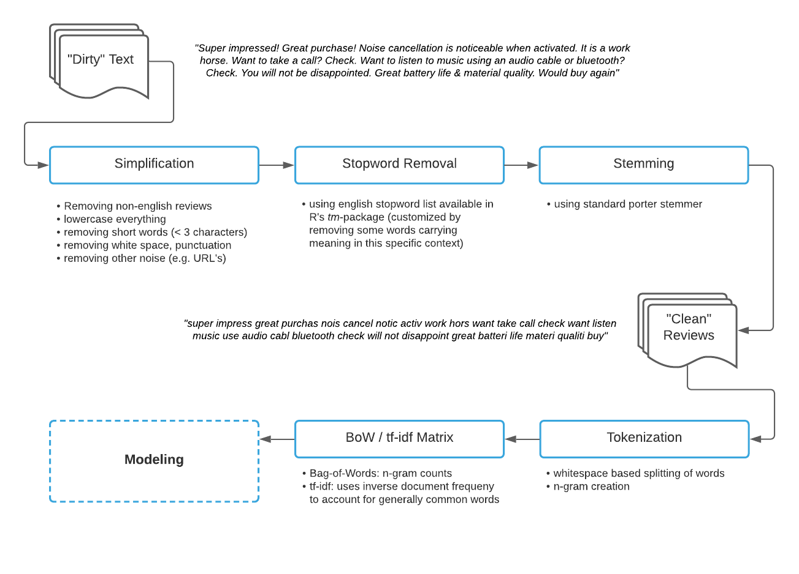
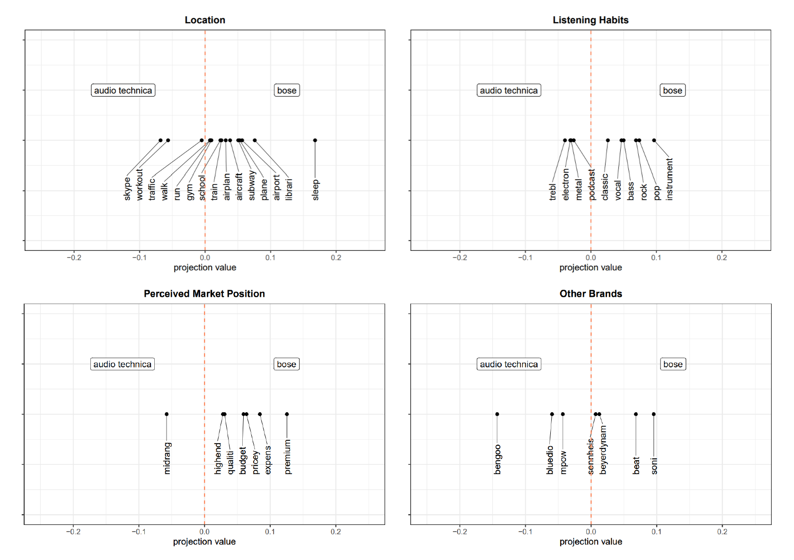
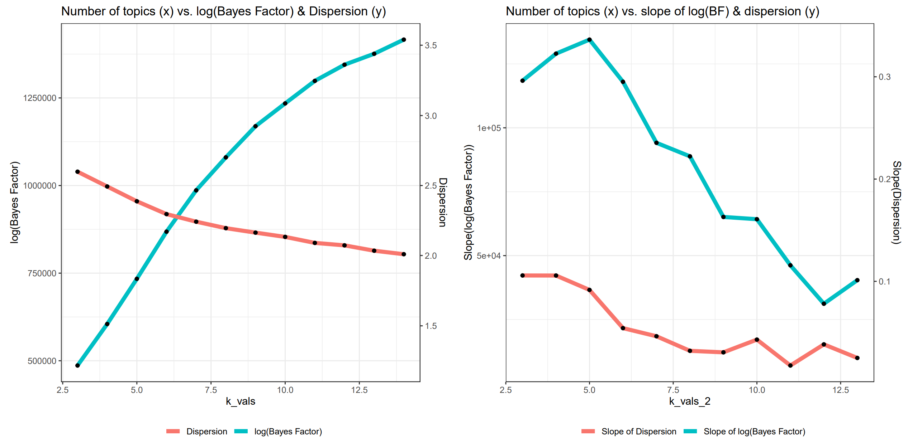

## Yannic's Data Science Portfolio

This document gives some insights into some of my past projects, with a focus on variety.

### Contents:
You can click the project to jump straight to the section.

1. [Analyzing Amazon Customer Reviews](#p1_link) *(R, text mining, Word2Vec, topic modeling, LDA)  
2. [Project 2](#p2_link) 
3. [Project 3](#p3_link) 
4. [Project 4](#p4_link) 
5. [Project 5](#p5_link) 

Markdown is a lightweight and easy-to-use syntax for styling your writing. It includes conventions for

```markdown
Syntax highlighted code block

# Header 1
## Header 2
### Header 3

- Bulleted
- List

1. Numbered
2. List

**Bold** and _Italic_ and `Code` text

[Link](url) and 
```

For more details see [GitHub Flavored Markdown](https://guides.github.com/features/mastering-markdown/).

### Jekyll Themes

Your Pages site will use the layout and styles from the Jekyll theme you have selected in your [repository settings](https://github.com/YannicP/PersonalPortfolio/settings/pages). The name of this theme is saved in the Jekyll `_config.yml` configuration file.

### Support or Contact

Having trouble with Pages? Check out our [documentation](https://docs.github.com/categories/github-pages-basics/) or [contact support](https://support.github.com/contact) and we’ll help you sort it out.


# <a name="p1_link"></a> Analyzing Amazon Customer Reviews

Goal of this project was to gain insights into a certain product category by analyzing reviews for respective products on Amazon. The Dataset was first filtered for heaphone reviews only. 

Before Analysis, the raw review have to be cleaned and transformed into a less noisy version. The Process taken was as follows:



Afterwards, different Analysis approaches were taken. Exploratory Data Analysis and Topic Modeling were combined to identify potenital features to target in order to improve customer satisfaction.

To get a fast view on the dataset, word clouds were created:


Through word2vec, the brand position was analayzed. This is useful to identify possible targets for marketing. The calculations were generated through projecting the different word embedding vecctors generated by the word2vec skip-gram network onto the axis between the two analyzed brands, *bose* and *audiotechnica* (See Bolukbasi et al. 2016 for Reference)



For example, Bose is more associated with instrumental, rock and pop music. This is important information and allows the brand to focus exactly these styles of music, improving the customer experience. It is also visible that customer group budget and premium brands, which seems natural.

Finally, topic modeling is applied to analyze different topics for importance/performance. This way, brand strengths and weaknesses are identified, allowing for meaningful strategic decisions.

For *Latent Dirichlet Analysis (LDA)*, the number of topics *K* is critical. Next to trial-and-error approaches, heuristics like *Bayes Factor* and *Dispersion* exist and are to be considered. From these heuristics, the optimal number of topics was set to *K=8*, as here, Dispersion and the logarithm of BayesFactor both started to converge as visible from the slopes below.



Through running the model, the probabilities *δ* and *ω* are generated. Thes probabilities indicate:

- __δ__: Probability of a word belonging to a topic
- __ω__: Probability of a topic being present in a document

Through calculating metrics such as the Lift or using tf-idf, the topics can be named. The individual topics present in the reviews were identified as:

The Top 10 words ranked for the individual topics by null-term lift were:


References:

[Bolukbasi et al. 2016] Tolga Bolukbasi and Kai-Wei Chang and James Zou and Venkatesh Saligrama and Adam Kalai. *Man is to Computer Programmer as Woman is to Homemaker? Debiasing Word Embeddings*. 2016
