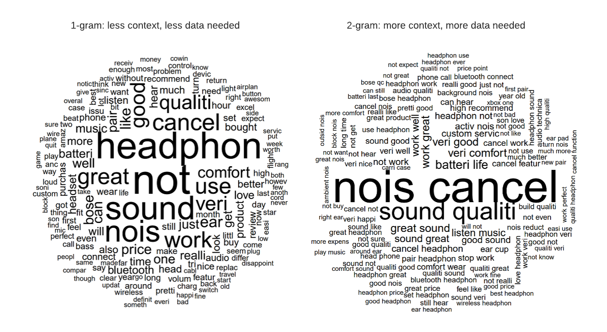

## Yannic's Data Science Portfolio

This document gives some insights into some of my past projects, with a focus on variety.

### Contents:
You can click the project to jump straight to the section.

1. [Deriving Strategic Targets by Analyzing Amazon Customer Reviews](#p1_link) (R, text mining, Word2Vec, topic modeling, LDA)  
2. [Using Computer Vision and Machine Learning to Identify Material Defects](#p2_link) (Matlab, Image Transformations, CNN, Transfer Learning, One-Class-SVM)
3. [Project 3](#p3_link) 
4. [Project 4](#p4_link) 
5. [Project 5](#p5_link) 

Markdown is a lightweight and easy-to-use syntax for styling your writing. It includes conventions for

```markdown
Syntax highlighted code block

# Header 1
## Header 2
### Header 3

- Bulleted
- List

1. Numbered
2. List

**Bold** and _Italic_ and `Code` text

[Link](url) and 
```

For more details see [GitHub Flavored Markdown](https://guides.github.com/features/mastering-markdown/).

### Jekyll Themes

Your Pages site will use the layout and styles from the Jekyll theme you have selected in your [repository settings](https://github.com/YannicP/PersonalPortfolio/settings/pages). The name of this theme is saved in the Jekyll `_config.yml` configuration file.

### Support or Contact

Having trouble with Pages? Check out our [documentation](https://docs.github.com/categories/github-pages-basics/) or [contact support](https://support.github.com/contact) and we’ll help you sort it out.


# <a name="p1_link"></a> Deriving Strategic Targets by Analyzing Amazon Customer Reviews

Goal of this project was to gain insights into a certain product category by analyzing reviews for respective products on Amazon. The Dataset was first filtered for heaphone reviews only. 

#### Preprocessing
Before Analysis, the raw review have to be cleaned and transformed into a less noisy version. The Process taken was as follows:


Afterwards, different Analysis approaches were taken. Exploratory Data Analysis and Topic Modeling were combined to identify potenital features to target in order to improve customer satisfaction.

To get a fast view on the dataset, word clouds were created:



#### Analyzing Brand Position
Through word2vec, the brand position was analayzed. This is useful to identify possible targets for marketing. The calculations were generated through projecting the different word embedding vecctors generated by the word2vec skip-gram network onto the axis between the two analyzed brands, *bose* and *audiotechnica* (See Bolukbasi et al. 2016 for Reference)


For example, Bose is more associated with instrumental, rock and pop music. This is important information and allows the brand to focus exactly these styles of music, improving the customer experience. It is also visible that customer group budget and premium brands, which seems natural.

#### Topic Modeling
Finally, topic modeling is applied to analyze different topics for importance/performance. This way, brand strengths and weaknesses are identified, allowing for meaningful strategic decisions.

For *Latent Dirichlet Analysis (LDA)*, the number of topics *K* is critical. Next to trial-and-error approaches, heuristics like *Bayes Factor* and *Dispersion* exist and are to be considered. From these heuristics, the optimal number of topics was set to *K=8*, as here, Dispersion and the logarithm of BayesFactor both started to converge as visible from the slopes below.


Through running the model, the probabilities *δ* and *ω* are generated. Thes probabilities indicate:

- __δ__: Probability of a word belonging to a topic
- __ω__: Probability of a topic being present in a document

Through calculating metrics such as the Lift or using tf-idf, the topics can be named. The individual topics present in the reviews were identified as:

The Top 10 words ranked for the individual topics by null-term lift were:

{:refdef: style="text-align: center;"}
{:height="80%" width="80%"}
{: refdef}

Therefore, the 8 Topics:

1. Overall satisfaction
2. Gifting
3. Noise cancellation
4. Brand/Model
5. Durability/Customer service
6. Comfort
7. Gaming performance
8. Connectivity/Battery

where derived.

#### Importance/Performance
To assess importance of a topic, K bivariate Linear Regression models were fitted using the standardized __ω__ probabilites as the regressor, predicting the rating score of the review. Through standardization, the regression coefficients become comparable and can be used for the calculation of a topic importance score. Performance was measured by weighing the rating of each review by the probability of the topic appearing in the respective document.

{:refdef: style="text-align: center;"}
{:height="80%" width="30%"}
{:height="80%" width="30%"}
{: refdef}

Performance (x-Axis) was plotted against Importance (y-Axis) for the brand *Bose*. The diagram is shown below.

{:refdef: style="text-align: center;"}
{:height="80%" width="80%"}
{: refdef}

From this, different strategic targets for *Bose* can be derived:
- Durability and customer support are possible targets for strategic priorization. However, there is likely some bias involved, as unsatisfied customers are more likely to write reviews. Additionally, some of the reviews likely refer to the retailers (Amazon) customer service.
- Gaming seems to be a potential target. Improvements in regard to the headphones gaming performance could drive customer satisfaction
- Battery Life and comfort are not driving ratings very much based on the regression coefficients. However, the are mentioned more likely in reviews that have only average ratings, therefore the headphones could likely be improved in this regard. 

More insights were generated, however, for readability and consiseness, these results are omitted here.

# <a name="p1_link"></a> Using Computer Vision and Machine Learning to Identify Material Defects
This project is an excerpt from my bachelor thesis. Therefore, no completely comprehensive overview is given.
The goal was the identification of material defects under specific conditions:

- only little data is available, as defect detection should be carried out for small production series. During processing, the camera takes more pictures and therefore generates additional data. However, defect detection should be possible right from the start (first few images). This poses a significant challenge.
- deffect detection has to be fast, as online defect detection should be possible. Therefore no extremely complex calculations can be carried out

Under these constraints, classical machine learning approaches are not useful, as CNN's need relatively large amounts of data. To combat this problem, a hybrid approach was taken, using classic computer vision techniques for early defect detection and supplementing this with transfer learning based one class support vector classification later

#### Image Acquisition

The first step in camera based defect detection is image acquisition. Here, an iDS Industry Camera was used. As Edge detection is crucial for detecting surface defects, the right camera parameters are needed when taking pictures. Below, the influence of falsely configured focus (left), low exposure (middle) and correctly configured parameters (right) are shown. It is visible that the edge with the surface defect is only visible in the transformed edge image if the correct parameters are used.


Afterwards, the image taken is transformed multiple times:


This helps to remove any image noise or dirt/metal outside the workpieces contour that would otherwise interfere with defect detection, as this is common especially during processes like milling. The goal of the segmentation is to use the resulting mask to select the relevant image regions only. The resulting segmentation mask of a simple workpiece along with the steps taken to generate it is shown below.


References:

[Bolukbasi et al. 2016] Tolga Bolukbasi and Kai-Wei Chang and James Zou and Venkatesh Saligrama and Adam Kalai. *Man is to Computer Programmer as Woman is to Homemaker? Debiasing Word Embeddings*. 2016
